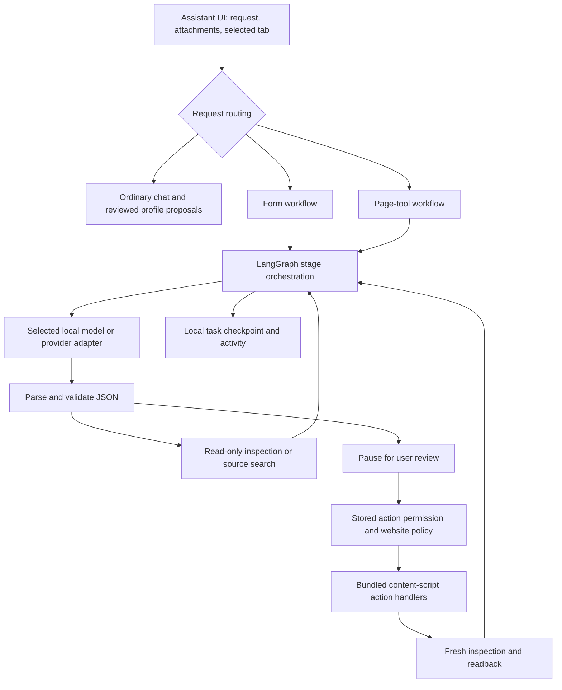

# Agent workflows (Safari 26+ and Chromium)

## Architecture at a glance

ApplyOnce has **one agent harness with two workflow modes**, plus ordinary chat. There is no supervisor agent, separate planner model, specialist worker pool, or agent-to-agent delegation. The selected model supplies proposals; application code controls execution, validates them and checks permissions. “Inspect”, “plan”, “validate” and “tool” are graph stages, not separate AI agents.



### Modes and access

| Mode/component | Model's responsibility | Available data and operations | Write boundary |
| --- | --- | --- | --- |
| Ordinary assistant chat | Answer questions, draft text, propose profile updates | Enabled profile, resume, applications and page attachment context; optional screenshots | Supported structured action proposals are validated and reviewed; page writes also require page-action permission |
| Form workflow (`kind: form`) | Propose values for observed field refs and identify missing facts | Fresh form inventory, required fields, validation state, enabled profile/resume facts, initial screenshots | Only reviewed existing-field edits; application code applies and reads back values |
| Page-tool workflow (`kind: page`) | Choose a search/read tool, propose one action, or return a summary | `find_elements`, `read_page_code`, `page_action`; short conversation, initial control inventory, last two tool results, initial screenshots | `page_action` first becomes a preview/review card; the model cannot approve or execute it directly |
| Passive autofill | No model involved | Saved profile and existing website autofill rules | Separate automatic autofill policy; not an autonomous agent |

The page-tool prompt does not automatically attach the profile or resume. Form planning deliberately reads those only when enabled. Ordinary chat context comes from the selected attachment chips. Page tools do not have filesystem, shell, arbitrary network, browser-debugger, or generated-JavaScript execution access. CSS/JavaScript resource fetching is a constrained source-reading operation, not a general HTTP tool.

Routing happens in `llm-ui.js`; agent-mode settings and explicit requests determine whether to enter the harness. `jaaAgentIsPageToolRequest` then uses request keywords to select page tools versus form filling. This is deterministic routing, not a routing LLM. The current classifier is heuristic: a request mentioning buttons/source/search selects page tools unless it is recognized as a form-fill request.

### Execution and ownership

1. The UI selects a tab, provider/model and attachments, then starts or resumes `jaaAgentLoop`.
2. `inspect` obtains fresh DOM information. Form inspection also compares previously applied values against the page.
3. `plan` calls the selected model once. The streaming adapter sends available response/reasoning text to the UI.
4. `validate` parses JSON and checks allowed tools, refs and values. Invalid responses receive bounded retry feedback.
5. Page reads run in `tool` and return to `plan`. Proposed writes end the graph invocation at `review`.
6. After user approval, application code checks the saved review, permissions and target state, checkpoints inspection, then performs the exact write.
7. A subsequent inspection drives verification. The task ends at `complete`, `needs_input` or `blocked`, or pauses again at `review`.

The form workflow uses deterministic readback verification. Page-tool completion is a model summary informed by observations; its `complete` stage is not independent proof of a page-side business operation. A click result means an event was dispatched, not that an application was submitted successfully.

### Source map

Paths below are relative to `ApplyOnce Extension/Resources/` unless stated otherwise. `dist/chromium/` is generated staging, not the source to edit.

| File | Responsibility |
| --- | --- |
| `llm/llm-ui.js` | Routing, streaming UI, review/apply controls, Stop and Resume |
| `llm/llm-workflow.js` | Task lifecycle, form planning/validation/readback, checkpoints and apply recovery |
| `llm/llm-page-tools.js` | Page-tool prompt, JSON validation, tool dispatch, repeated-read/failure detection |
| `scripts/agent-graph-entry.mjs` (repository root) | LangGraph nodes and conditional edges; bundled into `vendor/agent/graph.mjs` |
| `llm/llm-agent.js` | Structured action validation, review plans and application of approved actions |
| `llm/llm-tools.js` | Read-only attachment context and screenshot capture |
| `llm/llm-providers.js`, `llm/llm-local.js` | Hosted/gateway adapters and on-device inference; same workflow protocol |
| `page-tools.js`, `content.js` | DOM references, source reads, supported actions and extension message boundary |
| `page-policy.js`, `background.js`, `date-controls.js` | Authoritative permission gate and narrow browser/Workday adapters |
| `llm/llm-agent-events.js`, `llm/llm-agent-view.js` | Activity events, provider output, failure explanations and UI rendering |
| `llm/llm-store.js`, `storage.js` | Assistant settings and extension state |
| `diagnostics.js` | Generated build-time opt-in developer logger |

Safari macOS, Safari iOS and Chrome use these shared JS resources and extension messaging. Safari's native wrapper packages the extension; it is not another reasoning agent. Local inference runs on the device; hosted adapters send the selected context to the configured endpoint. OmniRoute is a gateway and may forward requests onward.

## Live activity, model-call limits, and diagnostics

The previous `Agent step 1/10` display counted model calls, including retries, against a task-wide default of 10. It was not a completion percentage. There is now no default model-call cutoff. The UI labels it **Model call 1**, shows elapsed time while waiting, streams provider output into a **Model output** panel, and preserves a readable **Agent activity** timeline for inspection, tool results, validation errors and permission blocks. Source/proposal JSON is visible in the live output panel, separate from the final answer. Only the latest 16,000 characters per streamed response/reasoning panel are displayed; the full response still reaches validation. Output uses text nodes, not executable HTML. Raw response panels last for the current UI session; activity summaries are saved with the conversation/checkpoint and are excluded from subsequent model prompts.

Reasoning is shown only when the provider actually returns it: local thought markers, OpenAI-compatible `reasoning_content`/textual `reasoning`, Anthropic `thinking_delta`, or Gemini thought text. Opaque signatures are ignored. A provider supplying no reasoning gets an explicit note; the application does not manufacture thoughts or enable extra inference budgets. References: [DeepSeek stream schema](https://api-docs.deepseek.com/api/create-chat-completion/), [Claude streaming](https://platform.claude.com/docs/en/build-with-claude/streaming), [Gemini thought summaries](https://ai.google.dev/gemini-api/docs/generate-content/thinking).

The reported Apply-button failure was a saved task with page actions enabled but the website excluded by the Sites allowlist. The old workflow retried the same permission failure ten times and replaced the reason with a generic budget message. Permission, navigation/disconnection and unsupported-action blocks now stop with the actual reason. Three consecutive invalid replies or failed tools stop early. The same tool request/result appearing three times within the last 12 reads stops a stalled loop, including alternating repeated searches. Otherwise calls continue until an answer, review, missing input, an error or user cancellation. This does not guarantee detection of every possible loop: a model issuing endlessly different reads still needs the user to press **Stop**. Longer runs can consume more tokens. Resume inspects before any write and clears the repeated-failure window. Older checkpoints lose their inherited ten-call cap on loading.

For programmatic callers, `jaaAgentLoop({ maxIterations: N, ... })` still supports an explicit positive model-call limit; omitted/zero means no limit. The normal Assistant UI does not supply a cap, and the old persisted `maxAgentIterations` setting is ignored. Explicit limits produce a specific pause reason; explicit continuation extends that allowance, while automatic post-apply verification does not. Call counts measure model requests, not graph nodes, tool executions or completion percentage.

Developer console loggers are disabled by default and can be enabled only through the build CLI:

```sh
# Chrome development build
npm run build:chromium -- --loggers

# Safari shared resources; then build/run the Xcode app
npm run build:agent -- --loggers

# Production: these regenerate diagnostics with logging disabled
npm run build:chromium
npm run build:agent
npm run package:chromium
```

Reload the extension and the webpage after changing builds. The flag is consumed by build tooling, not by Safari/Chrome launch arguments, URL parameters or extension settings. Chromium staging regenerates its own diagnostics file so a previous Safari debug build cannot leak logging into a normal Chromium package. `package:chromium -- --loggers` creates an explicitly requested debug package; omit the flag for release. For Safari, run the normal `build:agent` before a release Xcode build, because Xcode copies the current shared resources.

In the Assistant extension page's developer console, filter for `[ApplyOnce]`. `jaaDiagnostics.snapshot()` returns up to 200 recent records in that context; `jaaDiagnostics.clear()` clears them. Content-script failures have a separate context-local buffer. Logs include task/stage IDs, requested/reported model, call counts, tool names, durations, response lengths and error codes. They exclude request/response bodies, attachments, API keys and page URLs; known credential/email patterns are redacted in permitted metadata. No diagnostics are persisted or sent anywhere. Release builds emit no application debug logs and return an empty snapshot. The user-facing task activity and provider output remain available in production.

## Page tool usage

In Assistant, attach **Page** and choose the page, or start a request with `[agent]`. The **Inspect page code** prompt opens this path explicitly. Page inspection and interaction requests use the page-tool workflow; form-fill requests retain the existing structured form workflow.

**Allow agent actions on pages** defaults to off, including after an upgrade. Read tools remain available while off. Enable it to review and apply clicks, field edits, selections, checkbox/radio changes and scrolling. The permission also gates legacy assistant fill/edit/click/scroll endpoints. Website restrictions still apply. Existing automatic profile autofill has its own Websites settings and remains independent.

The model requests one JSON tool call per step, for both local and hosted providers:

| Tool | Arguments and behavior |
| --- | --- |
| `find_elements` | Optional `selector`, `role`, `text`, `exact`, `visible`, parent `ref`, `offset`, `limit`. Filters intersect. Any CSS-matchable element is searchable, including divs and open shadow roots. No filters lists common controls. Returns short summaries and document-specific refs. |
| `read_page_code` | `kind: html/css/javascript`, optional `ref`, literal `query`, `offset`, `limit`. Without a ref: live document HTML, or a paginated CSS/JS resource list. With an element ref: HTML, matching CSS rules plus computed styles, or inline event-handler source. With a resource ref: stylesheet or script source. |
| `page_action` | `action: click/fill/select/check/scroll`, an observed `ref`, and `value` or boolean `checked` when needed. Produces a review card; executes only after review and a fresh permission check. |

Example requests: `[agent] Find the Add experience button and show its HTML`, `[agent] Inspect the CSS of #email`, `[agent] Search the page JavaScript for validateEmail`, `[agent] Click the Show details button`.

Search defaults to 15 results (maximum 25); code reads default to 3,000 characters (maximum 6,000). `nextOffset` supports additional pages or literal source-search matches. Only the two latest tool observations and a short recent conversation are supplied to subsequent model calls. Full page source is never attached automatically. There is no default task call cap; optional explicit limits count each model call, including retries. Tool results are untrusted data in the prompt.

Actions use bundled content-script JavaScript and native setters plus input/change events. Role/text/CSS discovery and exact refs follow the locator approach described in [Playwright's locator documentation](https://playwright.dev/docs/locators). Playwright itself is not shipped in the extension. [Chrome's content-script documentation](https://developer.chrome.com/docs/extensions/develop/concepts/content-scripts) describes the portable DOM/isolated-world approach; the same shared resources run in [Safari web extensions](https://developer.apple.com/documentation/safariservices/safari-web-extensions). There is no model-generated JavaScript evaluation, debugger permission, or page-to-extension command bridge. Existing Workday main-world adapters remain narrowly scoped, with an additional permission check for agent-originated calls.

The authoritative permission is the separate `jaaPageActionsAllowed` storage key. Chat/model-setting saves cannot restore a revoked permission. Content scripts check stored permission at execution, not a flag supplied by a model or checkpoint. References fail after node replacement or document reload. Reviewed target changes reject execution. An interrupted write checkpoints inspection before execution; Resume reads again instead of replaying it. Native control edits report readback; dispatched clicks do not claim that a page-side business operation succeeded.

Known limits: tools target the selected tab's top-level document. Embedded frame documents and closed shadow roots are not inspected. HTML represents the current DOM with known sensitive/hidden field values redacted; inline scripts/styles are read separately. Dynamically registered listeners and framework closures are not exposed by portable DOM APIs. External source reads omit credentials, time out after eight seconds, and obey page CORS/site access; a resource above 2 MiB fails explicitly. Source maps and dynamically imported modules absent from the DOM resource list are not discovered. Stylesheets blocked by CSSOM access are counted; matching rules retain media/support conditions, while computed styles show the resolved result. Browser-trusted input requirements can prevent synthetic actions from working. Application submission/payment/destructive controls and sensitive/file inputs remain blocked. A narrowly scoped exception permits reviewed search submits: a Search/Search Jobs/Find Jobs control, an enabled search input, a same-origin HTTP(S) GET destination (including submitter overrides), and no sensitive or file controls in the form except hidden pagination metadata named `pagesize`, `page`, `offset` or `sort`. Other submit controls remain blocked by the supported-action checks; page handlers can still have side effects, which is why enabling permission and reviewing the exact target matter.

Tests in `tests/page-tools.test.js` exercise the full content-script message boundary with both browser namespaces, search/pagination, source reads, redaction, permission revocation, stale targets, blocked controls and the real bundled graph's review/recovery cycle.

## Choice and dependencies

Use LangGraph's Graph API with `StateSchema` and conditional edges. LangGraph owns stage sequencing; the model maps user facts to field values. The installed versions are pinned in `package-lock.json`: `@langchain/langgraph` 1.4.15 and `@langchain/core` 1.2.11.

| Option | Fit for this extension |
| --- | --- |
| LangChain `createAgent` | Useful for model-selected tool sequences; form inspection and verification should be mandatory application steps here. |
| LangGraph explicit workflow | Chosen: controls ordering, validation retries, review boundaries and completion checks. |
| Deep Agents | Adds planning, filesystem and delegation facilities that this current-page workflow does not need. |

Documentation consulted during implementation:

- [Workflows and agents](https://docs.langchain.com/oss/javascript/langgraph/workflows-agents)
- [Persistence](https://docs.langchain.com/oss/javascript/langgraph/persistence)
- [LangChain agents](https://docs.langchain.com/oss/javascript/langchain/agents)
- [Deep Agents overview](https://docs.langchain.com/oss/javascript/deepagents/overview)

## Execution

`llm-workflow.js` supplies handlers to the bundled Graph API:

1. Inspect the selected page and validation state; read enabled profile/resume attachments.
2. Ask the selected model for JSON field proposals and missing facts. The local runtime receives the full workflow prompt instead of the chat's fixed character truncation. The selected model context window still applies; oversized prompts fail visibly.
3. Validate refs, choices and JSON. Convert explicit month/year formats deterministically. Invalid proposals return to planning with feedback; three consecutive invalid responses stop the task.
4. Stop at review. On approval, apply only the exact reviewed field refs without saving those values to the profile or triggering bulk autofill.
5. Re-inspect and compare expected values with actual values; feed remaining failures back into planning. Identical failed edits stop instead of being repeated indefinitely.

Workday month/day/year controls expose a `datePart` in the inventory. Full resume dates are split into those components, and verification treats padded/unpadded numeric segments as equal. Segmented date writes run through a narrowly scoped main-world helper, waiting between keys and reacquiring rerendered inputs before checking the committed value.

Calendar buttons do not classify a date container as an option picker. Known segmented date inputs remain discoverable when their nested text input is read-only; keyboard events start at that input and bubble to the spinbutton. Ordinary read-only controls remain excluded. Passive date autofill also uses the asynchronous editor.

During reviewed edits, background scans pause. Scoped references retain ownership across rerenders so a stale profile value cannot overwrite the reviewed page value. Each write reports its field reference, editing method, final readback and any error. These diagnostics persist in the workflow snapshot and appear in failed verification messages.

Raw proposal JSON is not shown as chat prose. Model reasoning, when present, uses the existing collapsible reasoning display. Normal fill requests route to this workflow for local and hosted models; explicit agent-mode opt-out is preserved.

## Recovery and privacy

Application snapshots are stored under `jaaAgentTaskV1` in `browser.storage.local` after graph nodes. This is application-managed persistence, not a LangGraph database checkpointer. There is one current saved task, replaced by a new task; clearing the chat clears it.

Snapshots contain the task, relevant context, page identity, proposed/expected values, iteration count and next stage. They contain no API keys, image bytes, workers or model tensors. The selected model/provider is retained; changing providers does not silently route a saved task elsewhere. No LangSmith tracing or server is configured.

Before a webpage write, the next snapshot is set to inspection. If the UI closes during a write, Resume reads the page rather than replaying that write. Tab/URL changes reject recovery. A saved review can be redisplayed, with current values shown before applying. Safari can suspend the extension; this design supports user-initiated recovery rather than promising uninterrupted background inference.

## Build and validation

Use Node 20+ for tooling:

```sh
npm ci
npm run build:agent
npm test
npm run build:chromium
```

`build:agent` bundles `@langchain/langgraph/web` for Safari 26 into `Resources/vendor/agent/graph.mjs`. The generated bundle and license notices are checked in for Xcode builds. Chromium staging rebuilds it first. Runtime imports must be completely bundled; dependencies are never downloaded as executable code by the extension.

Tests exercise the actual bundle, including in a VM with browser globals and no Node module loader, plus mocked webpage/model interactions. They cover review/resume, malformed output, failed verification, cancellation, scoped writes, privacy toggles, and date formatting. These tests do not establish on-device model quality or iPhone memory/performance; those require a real Safari 26+ device run.

`tests/content-agent.test.js` additionally runs the full content script through its message interface in jsdom, with calendar buttons, read-only date segments, asynchronous input replacement, rejected edits, and competing saved profile values. This is a DOM integration test, not validation against a live Workday deployment.

## Local OmniRoute server

This integration targets [diegosouzapw/OmniRoute](https://github.com/diegosouzapw/OmniRoute), the self-hosted gateway. The user installs and starts it separately:

```sh
npm install -g omniroute
omniroute
```

Select **OmniRoute (local server)** in ApplyOnce, then open **API keys / servers**. The default base URL is `http://localhost:20128/v1`. The key is optional for a server accepting unauthenticated requests; if authentication is enabled, use its endpoint key from **OmniRoute Dashboard → Endpoints**. **Test connection / Load models** performs only `GET /v1/models` and populates the picker with the server's models and combos. It never sends a prompt or attachment. The catalog is refreshed on demand rather than persisted across server changes.

**Auto — let OmniRoute choose** sends the literal `model: "auto"`. Specific provider/model IDs, built-in `auto/*` variants and custom combo names are sent unchanged. There is no fixed GPT fallback and no Cheaper Inference routing header. See OmniRoute's [API reference](https://github.com/diegosouzapw/OmniRoute/blob/release/v3.8.51/docs/reference/API_REFERENCE.md) and [auto-routing guide](https://github.com/diegosouzapw/OmniRoute/blob/release/v3.8.51/docs/routing/AUTO-COMBO.md).

For Safari on iPhone, use the Mac's reachable LAN address, for example `http://192.168.1.42:20128/v1`, or a reachable HTTPS gateway URL. `localhost` on the phone refers to the phone. The Mac must remain running, with OmniRoute reachable from the phone's network; browser site/network access must permit the connection. OmniRoute documents `OMNIROUTE_SERVER_HOST` for the `omniroute serve` bind address in its [environment reference](https://github.com/diegosouzapw/OmniRoute/blob/release/v3.8.51/docs/reference/ENVIRONMENT.md).

OmniRoute is a local gateway and can forward prompts to connected online providers; provider costs and quotas still apply. The privacy banner makes this distinction from on-device ONNX inference. Migration switches the old `omnirouter` selection to `omniroute` but does not copy the old paid-service key, model or URL into the new connection. Saved tasks for that old provider need a new request.

## Form workflow scope

The workflow edits existing fields on the selected page. It does not submit forms, navigate pages, upload files, or create missing repeatable rows. Unsupported controls and missing facts require user intervention. Screenshots are initial visual context; fresh DOM inspections drive later corrections. A clean validation state is evidence about the current page, not proof that an application was submitted or that every inferred answer is semantically correct.

## Gemma GPU memory compatibility

Transformers.js 4.2.0 is currently vendored. Its Gemma conditional-generation path drops `num_logits_to_keep`, causing the decoder to request logits for every prompt token. The generation-session adapter in `llm-local.js` changes that scalar ONNX feed from 0 to 1 for both text and vision generation. Passing an option to `generate()` alone does not fix the affected runtime. See [upstream issue #1666](https://github.com/huggingface/transformers.js/issues/1666) and [merged fix #1681](https://github.com/huggingface/transformers.js/pull/1681); remove the compatibility adapter after adopting and testing a release containing that fix.

Local vision processes one screenshot at a time without limiting the number of captures. Processor inputs and generated output tensors are disposed between calls, and text follow-ups reuse an already-loaded Gemma vision model instead of replacing it with another pipeline. This removes avoidable allocations; it does not guarantee that arbitrary context sizes or a particular model fit every device.
